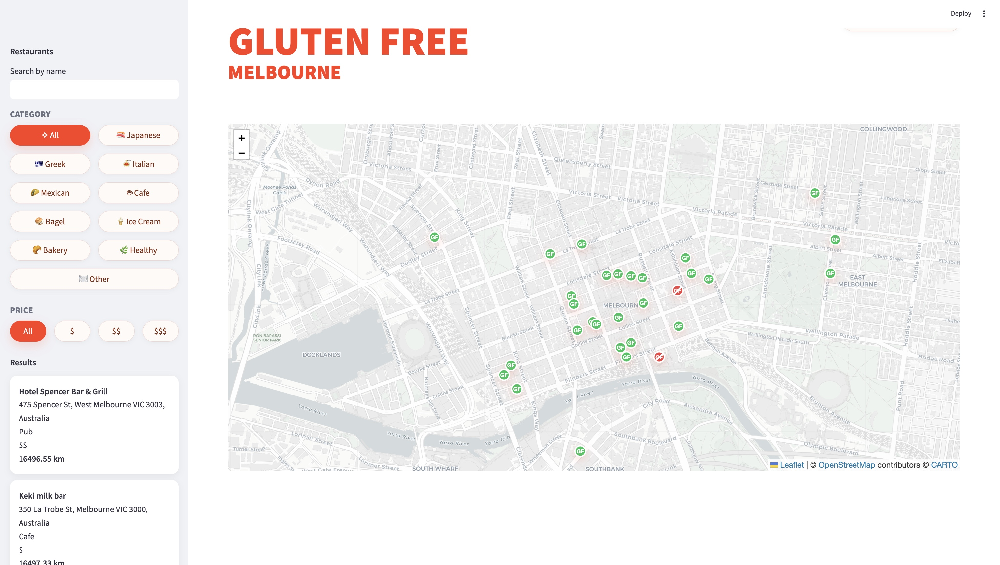
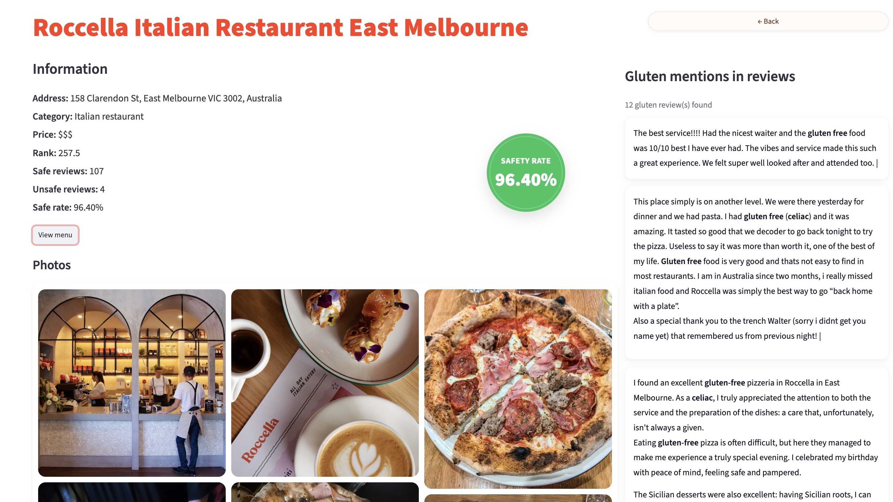

# Gluten-Free Restaurant Finder

**Live App:** https://celiac-safe-restaurant-finder-fjrfgs4st227sptmy5h5yj.streamlit.app/

Find safe gluten-free restaurants in Melbourne using data analysis and NLP techniques

---

## Overview

This application helps users identify gluten-free friendly restaurants in Melbourne by:

- Analyzing customer reviews
- Estimating a safety score for each restaurant
- Displaying results on an interactive map
- Highlighting gluten-related mentions in reviews
- Displaying restaurant images

---
## Methodology

- Reviews are filtered using gluten-related keywords (e.g. "gluten-free", "celiac", "GF")
- Text is normalized to ensure consistent matching
- Restaurants are scored based on:
  - Ratio of safe vs unsafe mentions
  - Frequency of gluten-related signals
- A ranking score is computed to prioritize safer restaurants
  
---
## NLP Component

- Text normalization and preprocessing
- Keyword-based classification of reviews
- Detection of gluten-related risk signals
  
---
## Results

- Processed X restaurants and X reviews
- Built a data-driven safety scoring system based on user-generated content
- Identified top gluten-safe restaurants in Melbourne

---
## Application Preview

### Map view



### Restaurant details



---

## How to run

```bash
pip install -r requirements.txt
streamlit run app/streamlit_app.py
```

---

## Technology Stack

- Python
- Streamlit
- Pandas
- Folium
- Scikit-learn (text analysis)

---

## Project Structure

```text
.
├── app/
│   └── streamlit_app.py
├── assets/
│   ├── image1.JPG
│   ├── image2.jpg
│   └── skyline.png
├── data/
│   ├── raw/
│   │   ├── raw_data.csv
│   │   └── imagenes.csv
│   └── processed/
│       ├── clean_data.csv
│       └── restaurant_ranking.csv
├── notebooks/
│   └── celiac_restaurant_analysis.ipynb
├── src/
├── .gitignore
├── README.md
└── requirements.txt
```

---

## Data

The dataset includes restaurant information, customer reviews, and image references.
Data is split into:

- **raw/**: original datasets
- **processed/**: cleaned and enriched data used in the app

---

## Features

- Interactive map with restaurant locations
- Gluten safety scoring based on reviews
- Keyword highlighting in reviews
- Restaurant filtering (category, price)
- Image display for each location
